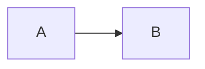

# rustdoc 렌더링 확장 계획

상태: 설계 제안. 이 문서는 구현 완료나 공개 API 확정을 의미하지 않는다.
작업 브랜치: `rustdoc-rendering`. 기존 `main`의 코드베이스에서 시작한다.

## 목표와 경계

사용자 요구는 rustdoc에서 Mermaid 다이어그램과 `$수식$`을 표현하는 것이다.
사용자가 문서에 CSS/JS를 직접 기입하는 매크로를 확장 기반으로 검토한다.
i18n 개발은 마무리하며 기존 파일 선택 매크로와 CLI의 동작을 보존한다.
이번 커밋은 범위와 계획만 다루며 렌더러나 새 CLI를 구현하지 않는다.

추천 구조는 **문서에서 명시적으로 사용하는 매크로 + 페이지에서 한 번 초기화하는
공통 런타임**이다. 전체 페이지에 자산을 넣는 빌드 경로는 별도로 구분한다.
매크로가 반환한 `doc` 문자열만으로 rustdoc의 전역 `<head>`나 다른 항목 페이지를
수정할 수 있다고 가정하지 않는다. 크레이트 설명에 넣은 매크로도 모든 하위 페이지에
자동 상속되는 설정으로 취급하지 않는다.

## 확인한 기반과 먼저 검증할 사항

- rustdoc은 안정 옵션 `--html-in-header`와 `--html-after-content`로 HTML을 추가할 수 있다.
  `--extend-css`도 제공하지만 `--markdown-css`는 Rust API 문서에는 적용되지 않는다.
  근거: [rustdoc 명령행 옵션](https://doc.rust-lang.org/rustdoc/command-line-arguments.html).
- Mermaid는 브라우저 초기화와 지정 노드 렌더링 API를 제공한다. 자동 전체 탐색보다
  textus가 선택한 문서 영역을 대상으로 실행하는 방식을 검토한다.
  근거: [Mermaid 사용법](https://mermaid.js.org/config/usage.html).
- 수식 렌더러는 KaTeX를 우선 후보로 한다. 자동 렌더 확장에는 구분자와 제외 태그 설정이
  있으며 `$...$`는 명시적으로 추가해야 한다. `$$...$$`를 먼저 인식하도록 설계한다.
  근거: [KaTeX 자동 렌더](https://katex.org/docs/autorender.html).

첫 구현은 작은 rustdoc fixture로 HTML과 브라우저 동작을 확인하는 실험이다.
본문 `<script>`/`<style>` 보존, 함수·필드·중첩 모듈·재수출 페이지에서의 배치,
접힌 문서 영역, 같은 페이지의 여러 매크로, 상대 URL 및 `file://` 실행을 확인한다.
실험 결과를 근거로 아래 API를 확정한다. docs.rs의 HTML/CSP 정책과 배포 제약은
별도 확인 대상이며 로컬 동작만으로 호환을 약속하지 않는다.

## 제안하는 매크로

이름과 인자 형식은 모두 제안이다. 기존 `include_str!` 매크로는 변경하지 않는다.

````rust
#[doc = cargo_textus::doc_assets!(
    css = ".docblock .note { border-left: 3px solid teal; }",
    js = "console.log('문서가 준비되었습니다');",
)]
#[doc = cargo_textus::render_doc!(r#"
## 흐름

시간 복잡도는 $O(n)$이다.
"#)]
pub fn example() {}
````

위 예제의 중첩 코드 블록은 실제 Rust raw 문자열의 내용이다.
`doc_assets!`는 CSS와 JS 문자열을 명시적으로 받는 작은 기반 API로 둔다.
CSS만 또는 JS만 허용하며 빈 호출, 알 수 없는 옵션, 중복 옵션은 오류로 안내한다.
사용자 JS 실행 시점은 문서 DOM 준비 이후로 정의하고, 동일 자산은 페이지 내에서
중복 설치하지 않는다. 서로 다른 JS는 선언 순서를 유지하는 것을 목표로 한다.
CSS는 기본적으로 페이지에 영향을 주므로 항목 내부에만 적용된다고 약속하지 않는다.
JS 역시 브라우저 페이지 권한으로 실행되며 격리된 샌드박스가 아니다.

문자열을 `<script>`/`<style>`에 단순 연결하면 `</script>` 같은 내용으로 HTML이
깨질 수 있다. 별도 데이터 인코딩과 런타임 삽입 방식으로 원문을 보존하는 설계를
검증한다. 사용자 자산과 수식·다이어그램 입력의 처리는 구분하며 후자를 임의 JS로
실행하지 않는다. 향후 파일 인자가 필요하면 인라인 입력과 다른 명시적 옵션을 두고
호출 패키지 기준 경로 및 Cargo 변경 추적을 먼저 확정한다.

`render_doc!`는 전달받은 Markdown 안의 Mermaid와 수식만 처리한다.
일반 `///` 주석 전체나 다른 항목을 탐색해서 소스를 치환하는 속성 매크로는 초기 범위에서
제외한다. 일반 주석 전체에 대한 자동 렌더가 필요하면 아래 전역 빌드 경로로 제공한다.

수식은 Markdown이 처리되기 전에 식별하는 것이 우선이다. Markdown의 강조 구문이나
역슬래시 처리로 TeX가 달라질 수 있으므로 정규식 한 번으로 문자열 전체를 치환하지 않는다.
코드 블록·인라인 코드·HTML 영역을 제외하는 구문 인식과 안전한 원문 보관이 필요하다.
`\$`, 짝 없는 `$`, 통화 표기와 수식의 모호성, `$$...$$`, 줄바꿈 처리 규칙을 먼저
예제로 정의한다. 변환 대상 밖의 Markdown은 보존한다.

## i18n과의 조합

다음과 같은 중첩 호출을 즉시 지원한다고 약속하지 않는다.

```rust
#[doc = cargo_textus::render_doc!(cargo_textus::include_str!("docs/guide.md"))]
```

바깥 절차적 매크로는 안쪽 매크로의 확장 결과가 아니라 입력 토큰을 받으므로
임의의 중첩 매크로를 평가할 수 없다. 1차 구현은 리터럴 입력을 대상으로 한다.
언어별 외부 Markdown에 대해서는 전역 런타임 경로의 처리 가능 범위를 검증하고,
필요하면 코어 경로 선택을 재사용하는 명시적인 파일 입력 API를 후속 설계한다.
기존 i18n 매크로 자체에 렌더링 책임을 추가하지 않는다.

## 전체 페이지 적용과 자산 배포

전역 적용은 rustdoc 헤더/후미 주입을 이용하는 별도 경로로 검토한다.
잠정 CLI는 `cargo textus render build`와 `cargo textus render open`이다.
실제 필요가 확인된 다음 CLI 분배를 기능별로 분리하고 i18n metadata 없이도 실행되게 한다.
설정도 i18n의 `languages`와 독립시킨다. 기존 rustdoc 플래그를 덮어쓰지 않는 전달 방식,
공백을 포함한 경로, 사용자 Cargo 설정과의 우선순위는 통합 테스트로 확정한다.

전역 런타임이 이미 생성된 HTML에서 `$...$`를 처리할 때는 Markdown 단계에서
손상된 TeX를 복원할 수 없다. 따라서 매크로 입력 경로와 지원 범위가 완전히 같다고
설명하지 않으며, 일반 문서 주석의 복잡한 수식에는 명시적 매크로 사용을 안내한다.

기본 배포 방향은 버전을 고정한 로컬 자산이다. Mermaid·KaTeX JS/CSS뿐 아니라
KaTeX 폰트와 라이선스를 포함하고 일반 빌드 중 CDN에 의존하지 않는 것을 목표로 한다.
정확한 버전과 번들 방식은 호환성·용량·라이선스를 검토한 뒤 결정한다.
페이지별 인라인 번들의 크기와 공유 파일 방식의 경로 문제를 실험에서 비교한다.
매크로 확장 중 임의의 target 경로에 파일을 쓰는 방식은 사용하지 않는다.

## 구현 순서와 완료 기준

1. **호환성 실험**: 최소 fixture로 HTML 삽입, 페이지 범위, DOM 준비 시점, Markdown과
   TeX의 상호작용을 검증한다. 통과한 방식과 한계를 이 문서에 기록하고 API를 확정한다.
2. **자산 매크로와 런타임**: `doc_assets!` 입력 검증, 인코딩, 실행 순서와 중복 방지를
   구현한다. `default-features = false`와 일반 Cargo 빌드에서도 사용할 수 있어야 한다.
3. **Mermaid**: 명시한 코드 블록을 변환하고 SVG 렌더를 확인한다. 잘못된 다이어그램은
   다른 문서의 렌더를 막지 않게 하며 원문과 오류를 확인할 수 있게 한다.
4. **수식**: `$...$`와 `$$...$$`, 제외 영역 및 escape 규칙을 구현한다. 잘못된 TeX,
   일반 달러 표기, 코드 예제, HTML 특수문자, 복수 수식을 검사한다.
5. **전역 경로와 i18n 조합**: 앞 단계 결과에 따라 헤더 생성·자산 배치·CLI를 추가한다.
   전역 주입이 불필요하면 CLI는 추가하지 않는다. 기존 i18n 회귀 테스트는 유지한다.
6. **사용 문서와 배포 검증**: 예제, 설정, 오류와 한계, 지원 브라우저/호스팅 조건,
   자산 라이선스와 갱신 절차를 기록한다.

단위 테스트는 파싱·원문 보존·인코딩을, Cargo/rustdoc 통합 테스트는 확장·파일 추적·
페이지 생성을, 브라우저 테스트는 실제 SVG/수식 DOM과 사용자 CSS/JS 적용을 확인한다.
라이트·다크 테마, 중첩 페이지, `file://`와 HTTP, 네트워크 차단 상태, 복수 호출을 포함한다.
fmt·clippy·관련 Rust 테스트에 더해 HTML 생성 성공과 실제 브라우저 렌더 성공을 구분해
보고한다. 구현은 위 단계별로 검증 후 목적별 커밋하며 push는 별도 요청 때만 수행한다.
